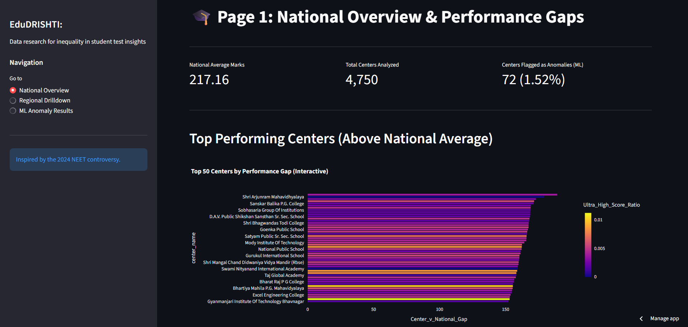
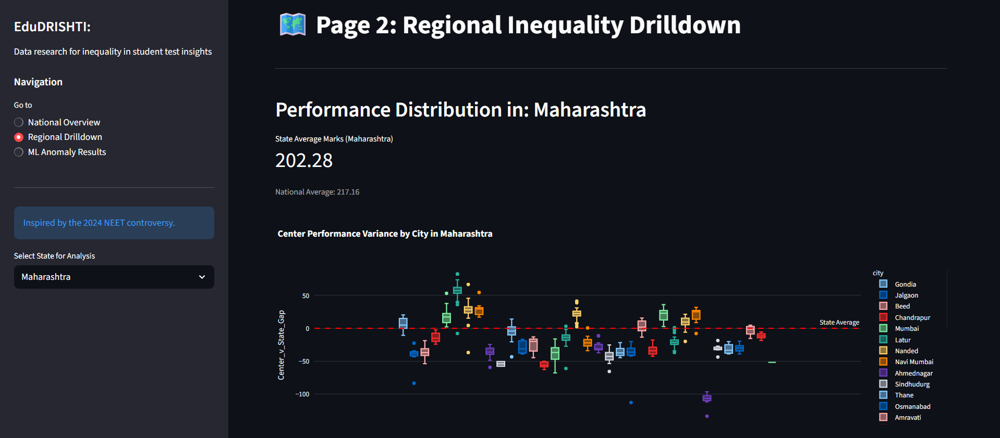
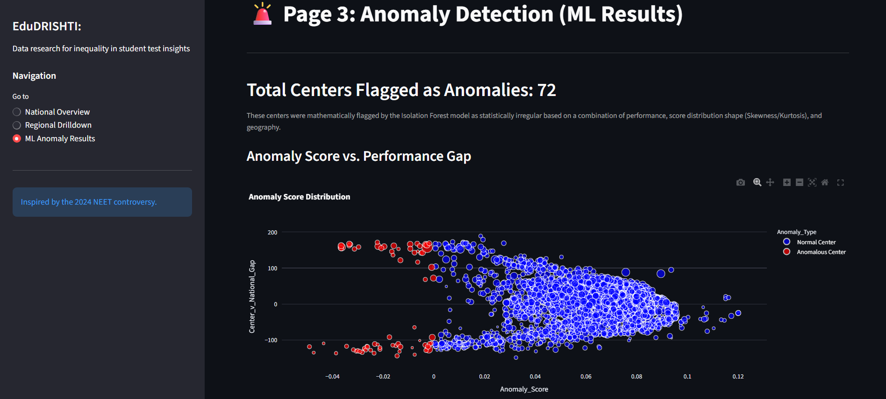
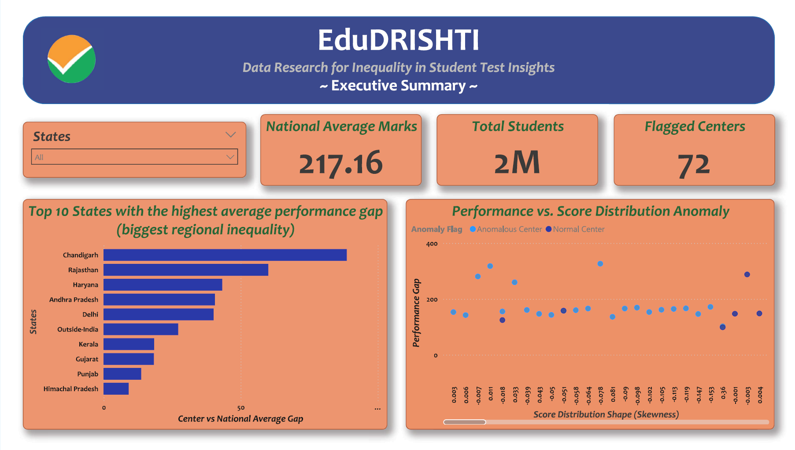
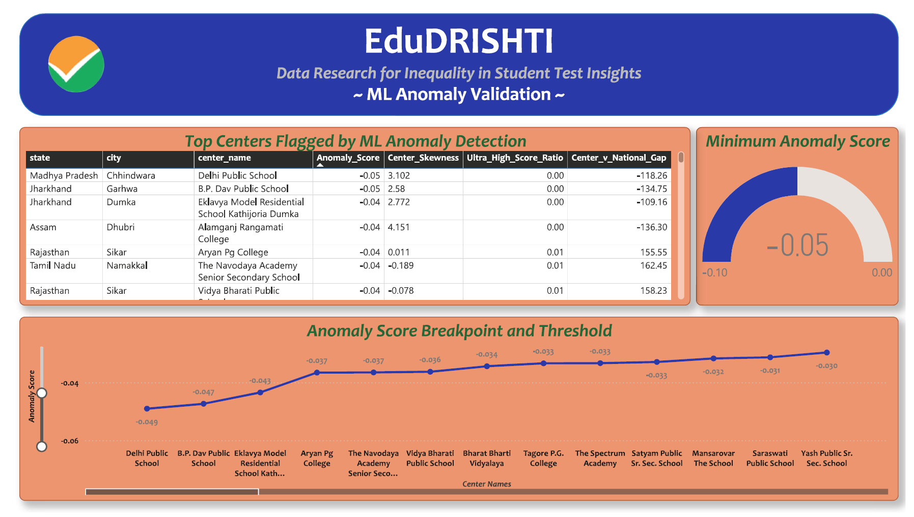

# 📚 EduDRISHTI | ML-Driven Anomaly Detection in High-Stakes Exams

## 📖 Introduction  
The **2024 NEET-UG controversy** exposed critical systemic vulnerabilities in India's national high-stakes examinations. The **EduDRISHTI (Data Research for Inequality in Student Test Insights)** project moves beyond anecdotal evidence to provide a rigorous, objective, and **data-driven analysis** of performance integrity and regional inequality using advanced data science and machine learning.

This project executes a full, end-to-end analytics pipeline:
- **Feature Engineering:** Developed sophisticated statistical metrics, notably **Center Skewness**, **Center Kurtosis**, and the **Center-v-National Gap**, to quantify the shape and deviation of score distributions for over 4,750+ exam centers.
- **Machine Learning:** Deployed an **Isolation Forest** model to mathematically flag centers exhibiting statistically **irregular score patterns** across a high-dimensional feature space.
- **Micro-Inequality Quantification:** Used **Ultra-High Score Ratio** to precisely locate and quantify the clustering of top-scoring candidates (marks ≥ 700).
- **Dual-Platform Deployment:** Delivered actionable intelligence via an **Interactive Streamlit Application** for model exploration and a **Professional Power BI Report** for executive summary and geospatial analysis.

## 🔗 Live Link  
👉 [Click here to explore the deployed dashboard](https://edudrishti.streamlit.app/) 

## 🖼️ Visual Previews
### Streamlit Interactive Dashboard Preview
This view highlights the dynamic, interactive nature of the web application, featuring the results of the ML model and validation charts.




---

### Power BI Professional Report Preview
This represents the static, multi-page layout optimized for executive decision-makers, showcasing geospatial findings and KPI summaries.




## ✨ Features  
- ⚙️ **Advanced Feature Engineering:** Extracted **Skewness** and **Kurtosis** from score distributions to act as primary statistical proxies for non-random clustering or uniformity of scores.
- 🎯 **Unsupervised Anomaly Detection:** Utilized the **Isolation Forest** algorithm from **Scikit-learn** to objectively identify **72 centers** as statistical outliers (Anomaly Flag = -1).
- 🗺️ **Geospatial & Inequality Analysis:** Mapped the **Center-v-National Gap** and the geographical clustering of anomalous centers to identify regional hotspots and structural inequality.
- 📊 **Dual Visualization Platforms:**
  - **Interactive Streamlit Dashboard:** Multi-page application for dynamic model validation and deep-dive exploration.
  - **Professional Power BI Report:** Executive-level report presenting high-level findings, KPIs, and geospatial concentration.
- 🧪 **Model Validation:** Integrated numerical proof (e.g., Average Skewness comparison between flagged and normal groups) directly into the dashboards to prove model integrity.

## 📊 Key Analytical Insights
This project provided critical, objective insights into the 2024 NEET-UG performance:
- ⚠️ **72 Statistically Anomalous Centers:** The ML model flagged 72 centers whose score distribution shape was mathematically inconsistent with the national pattern, providing a clear roadmap for targeted investigation.
- 📉 **Low/Negative Skewness Indication:** Flagged centers often showed unusually low or negative Skewness, strongly suggesting a non-random distribution of scores highly clustered toward the top or middle, rather than the expected high positive skew of a competitive exam.
- 🏙️ **Ultra-High Score Concentration:** Cities like Delhi/New Delhi, Jaipur, and Mumbai showed the highest ratios of Ultra-High Scorers (≥ 700 marks), indicating non-uniform performance clustering.
- 🌏 **Quantified Regional Advantage:** Identified states like Chandigarh, Rajasthan, and Haryana as exhibiting the highest average positive performance gaps, indicating a regional testing advantage.

## 🛠️ Tech Stack  
| Category               | Tools / Libraries                           | Purpose                                                                                 |
|------------------------|---------------------------------------------|-----------------------------------------------------------------------------------------|
| Data Handling (ETL)    | Python, **pandas**, **numpy**               | Data consolidation (2M+ records), Feature Engineering                                   |
| Machine Learning       | Scikit-learn, **IsolationForest**           | Unsupervised Anomaly Detection & Feature Scaling                                        |
| Visualization          | Plotly, **Streamlit**                       | Interactive Web Dashboard and Chart Generation                                          |
| Advanced Reporting     | Power BI, **DAX**                           | Executive Report Generation and Geospatial Analysis                                     |
| Notebook Environment   | Jupyter Notebooks *(eda.ipynb)*             | Data Exploration, Feature Derivation, and Model Prototyping                             |

## 🔄 Project Workflow
- 📂 **Data Preparation:** Raw data is stored in the `data/raw` directory.
- 🐍 **Python Pipeline:**
  - `master_data.py`: Handles the initial ETL, data consolidation, and complex feature engineering (Gaps, Ratios, Skewness/Kurtosis).
  - `anomaly_detection.py`: Contains the model definition, scaling, training, and prediction logic using **Isolation Forest**.
- 📊 **Final Data Export:** The enriched dataset is exported as `NEET_Master_ML_Data.csv`.
- 🖥️ **Dashboard Deployment:** The **Streamlit** app (`app.py`) loads the final data and presents the interactive ML results and regional insights.
- 📈 **Power BI Modeling:** The final CSV is imported into Power BI for report creation (`EduDRISHTI PowerBI Report.pbix`) and static export (`EduDRISHTI PowerBI Report.pdf`).


## 📂 Repository Structure  
```
├── 📁 data/
│   └── 📁 raw/
│    │   ├── NEET_2024_CenterWise_Stats.xlsx
│    │   └── 
│    ├── NEET_Master_Analysis_Data.csv
│    └── NEET_Master_ML_Data.csv
│
├── 📁 imgs/
│   ├── pbi_page1.png
│   ├── pbi_page2.png
│   ├── pbi_page3.png
│   ├── stream_page1.png
│   ├── stream_page2.png
│   └── stream_page3.png
│
├── EduDRISHTI PowerBI Report.pbix
├── EduDRISHTI PowerBI Report.pdf
│
├── EduDRISHTI_Synopsis.pdf
│
├── anomaly_detection.py
├── app.py
├── eda.ipynb
├── master_data.py
│
├── requirements.txt
└── README.md
```

## 🎯 Use Cases  
- 🏛️ **Policy & Governance:** Provides the National Testing Agency (NTA) and Ministry of Education with an objective, statistically validated list of centers for immediate audit and investigation into potential malpractice.
- ⚖️ **Legal & Compliance:** Offers quantifiable evidence (Anomaly Scores and Skewness deviation) to support or refute allegations of systemic irregularities in high-stakes litigation.
- 📚 **Resource Allocation for Equity:** Identifies regions with significant negative performance gaps (structural inequality) to help policymakers target educational resources, teacher training, and infrastructure improvements.
- 🔄 **System Integrity Monitoring:** The methodology is a replicable framework for continuous, near-real-time monitoring of future examination cycles to detect sudden shifts or new patterns of anomaly.
- 💼 **Data Science Showcase:** A powerful demonstration of applying unsupervised machine learning techniques to a high-impact, real-world social problem lacking labeled ground truth.

## ⚡ Setup Instructions  
1. **Clone the repository**  
   ```bash
   git clone https://github.com/Anushka-Sharma-008/EduDRISHTI.git
   cd EduDRISHTI
   ```
2. **Launch Streamlit Dashboard**
   ```
   streamlit run app.py
   ```

## 📄 Published Papers
This project is the basis for the following academic work, demonstrating the methodology's rigor and contribution to the field of educational data science:
- **International Journal of Sciences and Innovation Engineering (ISSN:3049-0251)** 
  - **Title:** A Data Science Approach to Identifying Statistical Anomalies and Inequality in High-Stakes National Examinations
  - **Status:** Submitted
  - **Author:** Anushka Sharma, Department of Artificial Intelligence and Data Science, Dr. Akhilesh Das Gupta Institute of Professional Studies, Delhi, India
  - **Link:** (I will update this link once the paper gets published)

## 🙋‍♀️ Author
**Anushka Sharma**  
🌐 [LinkedIn](https://www.linkedin.com/in/anushkasharma008/) • 🐱 [GitHub](https://github.com/Anushka-Sharma-008) 
🎓 Learning Data Science, Analytics & Machine Learning

## ⭐ Show Your Support
If you found this project helpful or inspiring:
- ⭐ Star this repository  
- 🛠️ Fork it to build upon or adapt it for your own use  
- 💬 Share feedback or suggestions via Issues/Discussions
